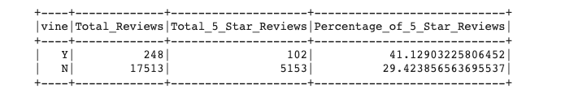

#  Amazon Vine Analysis

## Overview of the analysis:
This analysis is focused on analyzing Amazon reviews written by members of the paid Amazon Vine program. The Amazon Vine program is a service that allows manufacturers and publishers to receive reviews for their products. 

I will pick a dataset with Amazon review data and use PySpark to perform the ETL process to extract the dataset, transform the data, connect to an AWS RDS instance, and load the transformed data into pgAdmin. Next, i'll use PySpark to determine if there is any bias toward favorable reviews from Vine members in my dataset. 

## Results:

* How many Vine reviews and non-Vine reviews were there?
  - There are 248 Total vine reviews and 17513 non-vine reviews
 
* How many Vine reviews were 5 stars? How many non-Vine reviews were 5 stars?
  - There are 102 Total five star vine reviews and 5153 five star non-vine Reviews

* What percentage of Vine reviews were 5 stars? What percentage of non-vine reviews were 5 stars?
  -  41.13% of vine reviews are five star and 29.42% of non-vine reviews are five stars

## Summary:
### Is there any positivity bias for reviews in the Vine program?
* Yes we can see some positivity bias for reviews in the Vine program.  We see an 11.71% increase in five star reviews that are part of the Vine program

### Additional analysis that I could perform to support this?
* In addition to the analsis we conducted I would like to perform some NLP, in particular some seniment analysis to confirm that the review body aligns with the score provided.  
* I would also like to expand the analysis we performed to the other star numbers, 1 thru 4.
